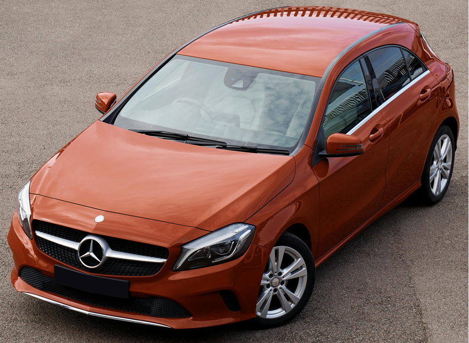
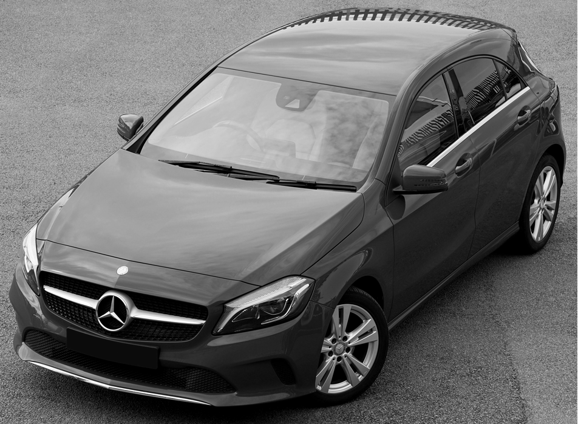
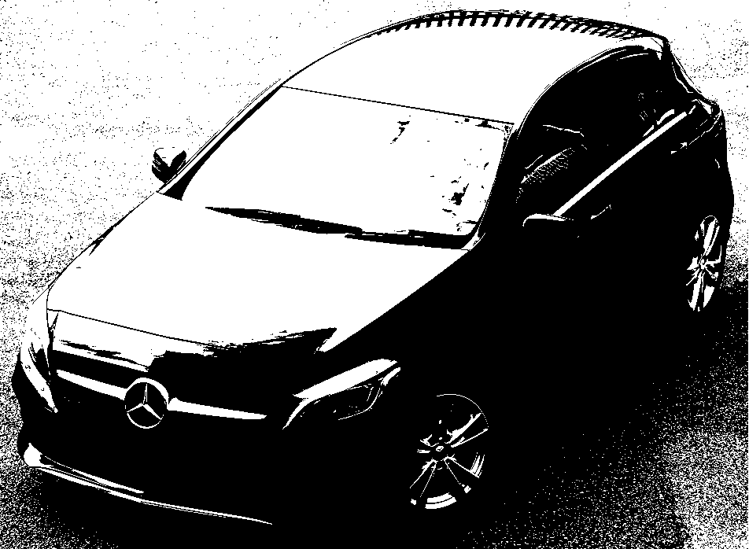

# Algoritmo_binarizacao

def ler_imagem_bmp(caminho):
    with open(caminho, 'rb') as f:
        # Ler cabeçalho BMP
        cabecalho = f.read(54)
        largura = int.from_bytes(cabecalho[18:22], byteorder='little')
        altura = int.from_bytes(cabecalho[22:26], byteorder='little')
        
        # Calcular o tamanho da linha (considerando padding)
        padding = (4 - (largura * 3) % 4) % 4
        tamanho_pixel_array = (largura * 3 + padding) * altura

        pixel_array = f.read(tamanho_pixel_array)

    return cabecalho, largura, altura, pixel_array

def salvar_imagem_bmp(cabecalho, pixel_array, caminho):
    with open(caminho, 'wb') as f:
        f.write(cabecalho)
        f.write(pixel_array)

def converter_para_cinza(largura, altura, pixel_array):
    nova_pixel_array = bytearray()
    padding = (4 - (largura * 3) % 4) % 4
    linha_size = largura * 3 + padding

    for y in range(altura):
        for x in range(largura):
            offset = y * linha_size + x * 3
            b = pixel_array[offset]      # Azul
            g = pixel_array[offset + 1]  # Verde
            r = pixel_array[offset + 2]  # Vermelho

            # Conversão para tons de cinza usando a fórmula
            valor_cinza = int(0.299 * r + 0.587 * g + 0.114 * b)

            # Adiciona o valor cinza para R, G e B
            nova_pixel_array.extend([valor_cinza] * 3)

        # Adiciona padding ao final da linha
        nova_pixel_array.extend([0] * padding)

    return nova_pixel_array

def converter_para_binario(largura, altura, pixel_array):
    nova_pixel_array_binaria = bytearray()
    padding = (4 - (largura * 3) % 4) % 4
    linha_size = largura * 3 + padding

    for y in range(altura):
        for x in range(largura):
            offset = y * linha_size + x * 3
            b = pixel_array[offset]
            g = pixel_array[offset + 1]
            r = pixel_array[offset + 2]

            valor_cinza = int(0.299 * r + 0.587 * g + 0.114 * b)

            # Binário: branco se acima do limiar, preto se abaixo
            valor_binario = 255 if valor_cinza > 127 else 0

            # Adiciona o valor binário para R, G e B
            nova_pixel_array_binaria.extend([valor_binario] * 3)

        # Adiciona padding ao final da linha
        nova_pixel_array_binaria.extend([0] * padding)

    return nova_pixel_array_binaria

def exibir_barra_progresso(iteracao, total):
    porcentagem = (iteracao / total) * 100
    barra_lida = '#' * int(porcentagem // 2)
    barra_vazia = ' ' * (50 - len(barra_lida))
    print(f'\r[{barra_lida}{barra_vazia}] {porcentagem:.2f}%', end='')

# Caminhos das imagens
caminho_entrada = "caminho\imagem.bmp" # aponte o caminho da imagem aqui 
caminho_saida_cinza = "caminho\imagem_cinza.bmp" # aponte o caminho da imagem aqui
caminho_saida_binario = "caminho\imagem_binaria.bmp" # aponte o caminho da imagem aqui

# Executando as funções
cabecalho, largura, altura, pixel_array = ler_imagem_bmp(caminho_entrada)

# Converter e salvar imagem em tons de cinza
nova_pixel_array_cinza = converter_para_cinza(largura, altura, pixel_array)
salvar_imagem_bmp(cabecalho, nova_pixel_array_cinza, caminho_saida_cinza)

# Exibir progresso da conversão para cinza
exibir_barra_progresso(1, 2)

# Converter e salvar imagem binária
nova_pixel_array_binaria = converter_para_binario(largura, altura, pixel_array)
salvar_imagem_bmp(cabecalho, nova_pixel_array_binaria, caminho_saida_binario)

# Exibir progresso da conversão para binário
exibir_barra_progresso(2, 2)

print("\nImagens geradas com sucesso!")

## Imagem original...

## Imagem cinza...

## Imagem binariaa...

